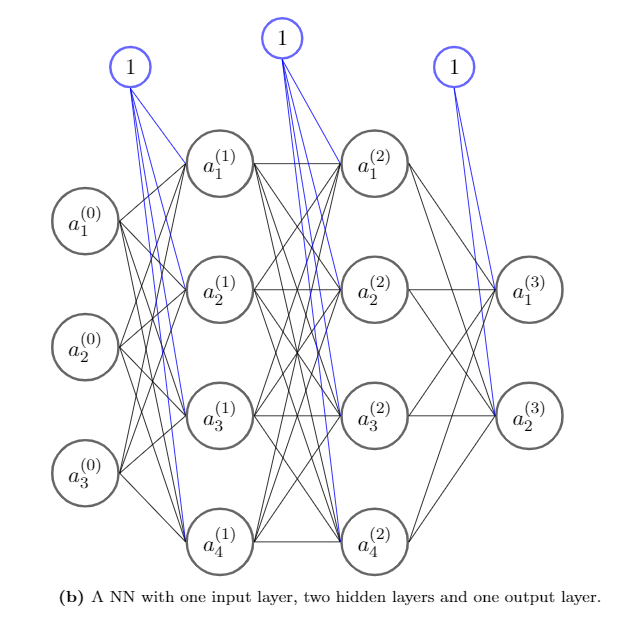

```{r setup, include=FALSE}
knitr::opts_chunk$set(echo = TRUE)
```

# Neural Networks

Artificial neural networks are inspired by the way in which neurons in the human
brain transmit electric signals. The idea is to construct a graph, where the nodes
are referred to as neurons, and thus pass information through the network, somewhat
like electronic signals are passed through the human brain.

Supervised learning technique that can be used for both regression and classification.

A NN can be illustrated as a weighted graph of $L \in \mathbb{N}$ layers, with 
$d_{(i)} \in \mathbb{N}$ neurons in each layer, $i = 0,1,\ldots, L$. The layers 
are not internally connected by edges. However, an edge is present from each neuron 
in layer $j$ to each neuron in layer $j+1$ for $j=0,1,\ldots,L-1$. Each neuron is 
assigned a value, referred to as an activation.

The activation of neuron $k$ in layer $i$ is defined as 

\begin{align}
     a^{(i)}_k=f\left(\sum_{n=1}^{d_{(i-1)}} w_{n,k}^{(i)}a^{(i-1)}_n+b^{(i)}_k\right), \quad i = 1,\ldots,L,\quad w_{n,k}^{(i)} \in \mathbb{R}, \quad b^{(i)}_k \in \mathbb{R},\quad k=1,\ldots,d_{(i)},
\end{align}

where $w_{n,k}^{(i)}$ is the weight of the edge connecting neuron $n$ in layer $i-1$ to neuron $k$ in layer $i$. The term $b^{(i)}_k$ is refereed to as a bias of neuron $k$ in layer $i$. Lastly, $f:\ \mathbb{R} \rightarrow A, \: A\subseteq\mathbb{R}$ is referred to as the activation function.

Notice that by defining $w_{0,k}^{(i)}=b^{(i)}_k$ and $a^{(i-1)}_0=1$ we can simplify the activation as

\begin{align*}
    a^{(i)}_k=f\left(\sum_{n=0}^{d_{(i-1)}} w_{n,k}^{(i)}a^{(i-1)}_n\right), \quad i = 1,\ldots,L,\quad w_{n,k}^{(i)} \in \mathbb{R},\quad k=1,\ldots,d_{(i)}.
\end{align*}

## Structure

The creator of the NN determines the amount of neurons and hidden layers based on some initial guess of what the NN would need in order to perform a given task. When adding multiple hidden layers with many neurons in each layer, the NN can become a ''black box``, i.e. it is hard to determine what the NN actually does to give the output. This can be a problem for instance in the finance industry where the risk management team needs to understand the shortfalls of the NN. Thus one needs to be careful when determining the structure of a NN.
Simple structure is called the perceptron;


Can be extended to more complicated structures;



## Training

The general idea of training is to calculate the activations throughout the network until the output is calculated. Then calculate the cost function, and using a gradient descent algorithm trying to minimize the cost function by use of the chain rule. This procedure is referred to as the back propagation algorithm. Since the input of the model is given, we want to change the weights and biases to minimize the cost function. We update the weights and biases in the following way

\begin{align*}
    w_{j,k}^{(i)\: new}&=w_{j,k}^{(i)\: old} - \eta \frac{\partial C}{\partial w_{j,k}^{(i)}},
\end{align*}

where $\eta$ is the learning rate, or the step length in the gradient descent. Thus we need $\frac{\partial C}{\partial w_{j,k}^{(i)}}$ for each $j,k$ and $i$. In the case with only one output neuron, and by use of the linearity of the differential operator, we have

\begin{align}
    \frac{\partial C}{\partial w_{j,k}^{(i)}} = \frac{1}{2n}\sum_{s=1}^n \frac{\partial}{\partial w_{j,k}^{(i)}}(\hat{y}_s-y_s)^2=\frac{1}{2n}\sum_{s=1}^n\frac{\partial C_s}{\partial w_{j,k}^{(i)}},
\end{align}

where $C_s=(\hat{y}_s-y_s)^2$. Thus the essence of the problem is to compute the differential of $C_s$ wrt. the weight $w_{j,k}^{(i)}$, which is done using the chain rule, i.e.

\begin{align}
    \frac{\partial C_s}{\partial w_{j,k}^{(i)}}&= \frac{\partial C_s}{\partial z_j^{(i)}}\frac{\partial z_j^{(i)}}{\partial w_{j,k}^{(i)}}, \nonumber \\
    \label{eq:z}
    z_j^{(i)}&= \sum_{n=0}^{d_{(i-1)}}w_{n,j}^{(i)} a_n^{(i-1)}.
\end{align}

The calculation will be done in two parts, where the first derivative will be referred to as the error for input $s$. Like for the activations, we will not explicitly write the $s$ dependency. Thus the error for input $s$ will be denoted by $\delta^{(i)}_{j}$, i.e.

\begin{align*}
    \delta^{(i)}_{j} = \frac{\partial C_s}{\partial z_j^{(i)}}.
\end{align*}

The second derivative is computed as such

\begin{align*}
    \frac{\partial z_j^{(i)}}{\partial w_{j,k}^{(i)}} =\frac{\partial}{\partial w_{j,k}^{(i)}}\sum_{t=0}^{d_{(i-1)}}w_{t,k}^{(i)}a_k^{(i-1)} = a_k^{(i-1)}.
\end{align*}

Thus the derivative of the cost function for input $s$ is 

\begin{align*}
    \frac{\partial C_s}{\partial w_{j,k}^{(i)}} = \frac{\partial C_s}{\partial z_j^{(i)}}\frac{\partial z_j^{(i)}}{\partial w_{j,k}^{(i)}}= \delta_{j}^{(i)}a_k^{(i-1)},
\end{align*}

which is the product of the error term for neuron $j$ in layer $i$ and the activation of neuron $i$ in layer $k-1$.

With the groundwork above, we are ready to consider the backpropagation algorithm. It consists of a forward phase, where one computes the activation for every neuron in each layer by feeding the NN and a backward phase, where one calculates the error estimates. 

Once both phases are complete, we have the necessary information to calculate the change in the weights. 

\begin{align*}
    \Delta w_{j,k}^{(i)}=-\eta \frac{1}{2n}\sum_{s=1}^n\frac{\partial C_s}{\partial w_{j,k}^{(i)}} = -\eta \frac{1}{2n}\sum_{s=1}^n\delta_{j}^{(i)}a_k^{(i-1)}.
\end{align*}

During the forward phase, we achieve all the activations, $a_k^{(i-1)}$. We achieve the activations starting in the first layer, then the second layer, etc. It is thus left to calculate all the $\delta_j^{(i)}$. This is the backwards phase, since we achieve them in reverse order. The $\delta$ for the last layer can be calculated by 

\begin{align}
    \delta_i^{(L)}= \frac{\partial C}{ \partial z_i^{(L)}} = \frac{\partial}{\partial z_i^{(L)}} \left( \frac{1}{2} (f(z_i^{(L)})-y)^2 \right)= f(z_i^{(L)} -y)f'(z_i^{(L)}).
    \label{eq:delta_last}
\end{align}

For the remaining errors, the chain rule gives 

\begin{align}
    \delta_i^{(k)}= \frac{\partial C}{ \partial z_i^{(k)}}= \sum_j \frac{\partial C}{ \partial z_j^{(k+1)}} \frac{\partial z_j^{(k+1)}}{ \partial z_j^{(k)}}=\sum_j \delta_j^{(k+1)} \frac{\partial z_j^{(k+1)}}{ \partial z_j^{(k)}}.
    \label{eq:delta_rest}
\end{align}

## Practical implementation

Learning the Black \& Scholes price map

\begin{align}\label{eq:BlackScholesFormel}
    F(t,S_t) &= S_t\Psi(d_2)-\mathrm{e}^{-r(T-t)}K\Psi(d_1),\quad 0\leq t \leq T, \\
    d_1 :&= \frac{\log(\frac{S_t}{K})+(r-\frac{\sigma^2}{2})(T-t)}{\sigma\sqrt{T-t}}, \nonumber \\
    d_2 :&= d_1 + \sigma\sqrt{T-t}, \nonumber
\end{align}

```{r}
suppressMessages(library(tidyverse))
suppressMessages(library(neuralnet))
suppressMessages(library(sigmoid))
Data <- read_csv("ActualBlackScholesPrices.csv") %>% suppressMessages()
head(Data) # A view of the data

#Random sampling into test and train set

set.seed(69)
index <- sample(1:nrow(Data),round(0.75*nrow(Data)))
train <- Data[index,]
test <- Data[-index,]


nn <- neuralnet(Price ~ ., data = train,  linear.output = TRUE, hidden = c(10))

plot(nn, rep = "best") 

(test$Price - compute(nn, test)$net.result %>% as.numeric) %>% mean %>% round(5)

set.seed(6969)
nn <- neuralnet(Price ~ ., data = train, linear.output = TRUE, hidden = c(10),
                act.fct = relu)

plot(nn, rep = "best") 

(test$Price - compute(nn, test)$net.result %>% as.numeric) %>% mean %>% round(5)
```

